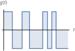

# QuasiHamiltonianRTN.jl

This package allows for the numerical solution of the dynamics of a quantum system
affected by classical *random telegraph noise* (RTN), using the *quasi-Hamiltonian method* introduced in
[Joynt *et al.* (2011)](https://dx.doi.org/10.1142/S0217979211100990).

> NOTE: The algorithm complexity is linear in the number of noise states,
> meaning that it is exponential for independent fluctuators.

## Model

Consider a quantum system described by the density operator $\rho(t)$, with an
Hamiltonian that is function of one or more stochastic processes $\{g_i(t)\}$.
The dynamics of the system is described by the dynamical map

```math
\begin{equation}
\label{eq:map}
\rho(t) = \left\langle \mathcal{T} e^{-i H[\{g_i(t)\}] t} \; \rho(0) \; \mathcal{T} e^{i H[\{g_i(t)\}] t} \right\rangle_{\{g_i(t)\}}
\end{equation}
```

When the number of possible configurations of the classical environment is small
enough, we can employ the exact method described in [Details on the method](@ref).

A typical case of use is RTN: a stochastic noise which can have two values,
for example $(\pm 1)$, and jumps between them with a certain switching rate $\gamma$.



The package `QuasiHamiltonianRTN` allows for obtaining a numerically exact solution
of the dynamics without recurring to Montecarlo simulations of the equation \eqref{eq:map}.


##  Usage
To use the package, first construct an array of matrices, in which each element
corresponds to the Hamiltonian with a particular realization of the noise sources.

For instance, if there are two noise sources, the array will be composed of four
Hamiltonians.

Once the vector has been defined, say `H`, we generate the quasi-Hamiltonian
matric


## Reference
```@docs
QuasiHamiltonianRTN.evolution
QuasiHamiltonianRTN.igen
QuasiHamiltonianRTN.bloch_vector
QuasiHamiltonianRTN.quasiHamiltonian
QuasiHamiltonianRTN.Vnoise
QuasiHamiltonianRTN.commutator
QuasiHamiltonianRTN.density_operator
QuasiHamiltonianRTN.random_density_matrix
QuasiHamiltonianRTN.structure_constants
QuasiHamiltonianRTN.unitary_op
```
